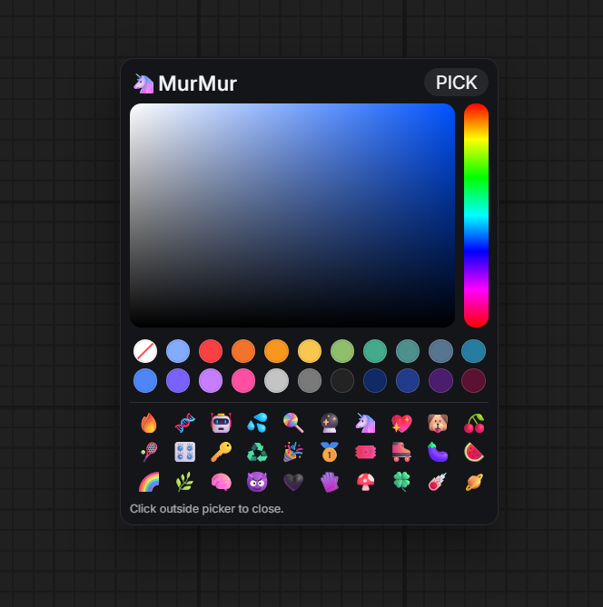

# 🦄 MurMur

### 给 ComfyUI 节点和分组用的轻量装饰型颜色工具

`MurMur` 是一个非常小的 ComfyUI 自定义节点包，只做一件事：
快速给节点和分组上色，并顺手加一点 emoji 装饰。

不需要为了一个颜色选择器去安装一个大型节点包。
`MurMur` 的目标很简单，就是把“快速美化节点”这件事单独做干净。

> 关键词：ComfyUI 颜色选择器、ComfyUI 节点上色、ComfyUI 分组上色、ComfyUI 工作流美化、ComfyUI 节点装饰。

## 为什么做它

很多现有方案都是在一个大包里“顺手带一个颜色功能”。
如果你的真实需求只是快速处理节点外观，这种方式完全不划算。

`MurMur` 只针对这一套流程：

1. 选中节点或分组
2. 快速打开颜色面板
3. 改颜色
4. 继续工作

就这么简单。

它不是传统意义上的生产节点，而是一个非常纯粹的体验改良工具。
如果你每天都要在一堆工作流里看节点、找节点、分辨节点，它就很有价值。

## 功能

- 按 `Tab` 打开悬浮颜色选择器
- 给已选中的节点上色
- 给已选中的分组上色
- 给已选中的节点标题加 emoji 前缀
- 可拖动标题栏移动面板，并自动记住位置
- 调色板保留最近一次使用的颜色
- 支持恢复主题默认颜色

## 如果你搜索的是这些

如果你在找下面这些东西，那你大概率就是在找 `MurMur`：

- 如何给 ComfyUI 节点上色
- 如何给 ComfyUI 分组上色
- ComfyUI 颜色选择器
- ComfyUI 节点美化
- 不想装大包，只想单独要一个上色工具
- 想让工作流更容易阅读、更舒服

## 重要说明

- Emoji 只作用于已选中的节点标题
- 分组支持上色，但不支持写入 emoji 到分组标题
- 点击面板外部即可关闭
- 这个包只注册了一个简单节点，因为重点是这个 UI 工具本身

## 安装

1. 把整个目录复制到 `ComfyUI/custom_nodes/`
2. 重启 ComfyUI
3. 搜索 `MurMur`

## 使用方法

1. 选中节点或分组
2. 按 `Tab`
3. 选择颜色、使用最近颜色，或恢复默认颜色
4. 如有需要，点击 emoji 给节点标题添加前缀
5. 点击面板外部关闭

## 文件结构

- [__init__.py](./__init__.py)：ComfyUI 包注册入口
- [murmur_picker.py](./murmur_picker.py)：唯一注册的节点
- [js/murmur.js](./js/murmur.js)：悬浮 UI、颜色逻辑、emoji 面板

## 关于语言切换

GitHub README 不支持真正原生的交互式 tabs。
因此这个仓库使用：

- `README.md` 顶部语言切换入口
- 单独的英文/中文 README 文件

## 推荐 GitHub Topics

建议在 GitHub 仓库中添加这些 topics：

- `comfyui`
- `comfyui-custom-nodes`
- `comfyui-node`
- `color-picker`
- `node-styling`
- `workflow-ui`
- `graph-ui`
- `quality-of-life`
- `emoji`
- `custom-nodes`

## 简短介绍文案

> MurMur 是一个超小型 ComfyUI 自定义节点，只做节点和分组的快速上色。不需要安装一整包工具，不需要忍受埋得很深的颜色面板，就是一个简单直接的悬浮样式工具，让工作流更清晰、更好看、更容易使用。
